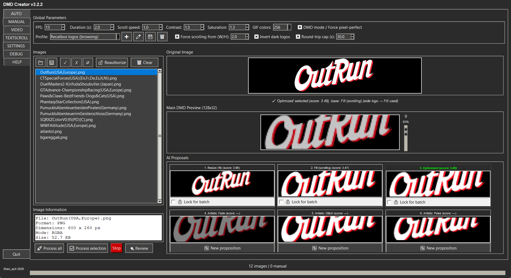
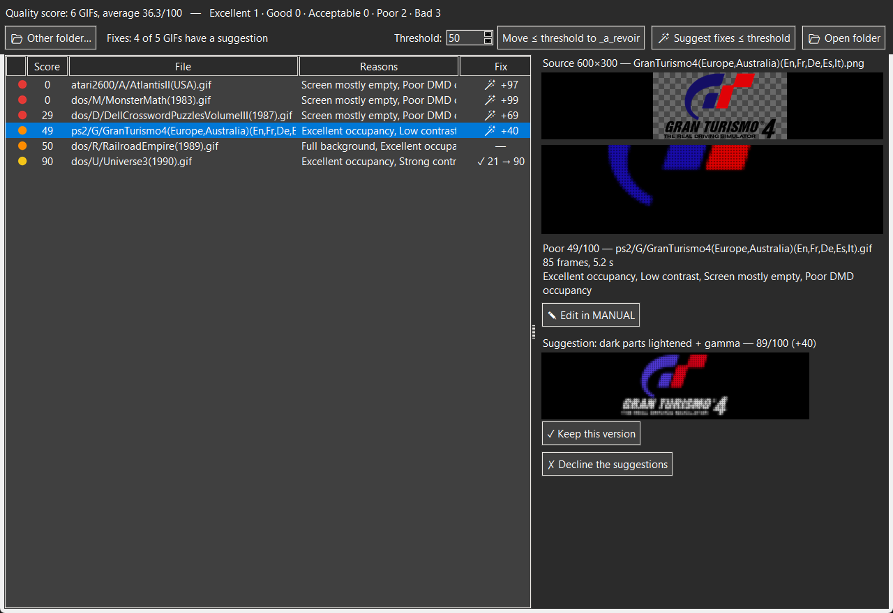
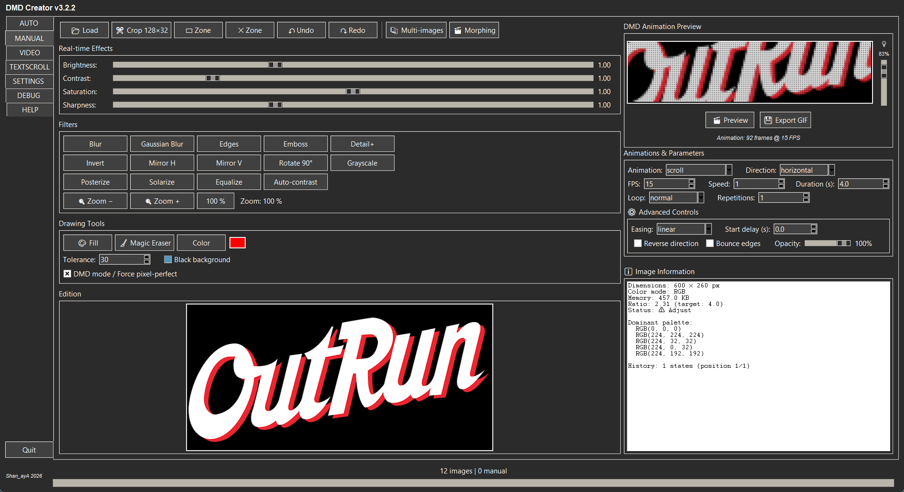
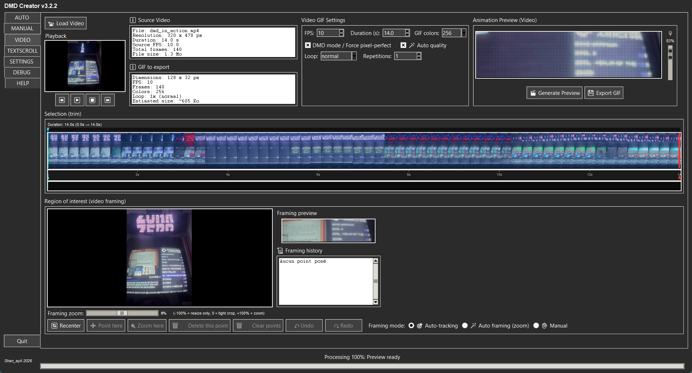
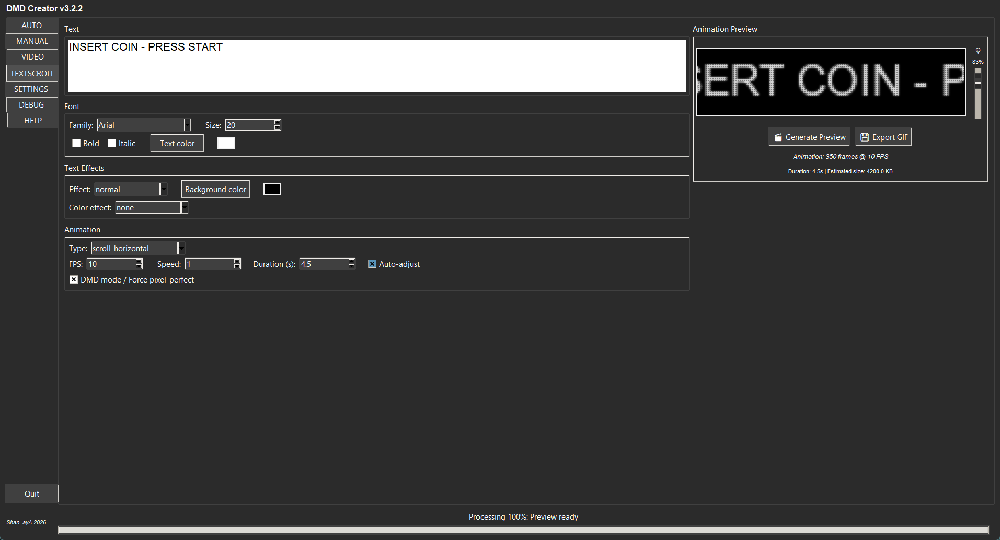

[🇫🇷 Français](./README.md) · 🇬🇧 **English** · [🇪🇸 Español](./README_ES.md)

# DMD GIF Creator 128x32 — v3.2.2

Create GIFs optimized for 128×32 DMD displays (arcade cabinet, pinball,
[RecalBox DMD](https://github.com/shan-aya/RecalBoxDMD)) from **images**, a **video**
or **animated text**, with automatic analysis, advanced manual editing and batch
processing of whole folders.

(Formerly "DMD GIF Converter".)

## Download

**Windows**: download `dmd_gif_creator_v322.exe` from the
[latest Release](https://github.com/shan-aya/DMD_GIF_creator/releases/latest) and run
it — nothing to install.

The executable is not signed: Windows SmartScreen may ask for confirmation on first
launch ("More info" then "Run anyway"). If an antivirus blocks it during batch
processing (anti-ransomware protection), it is a false positive: see "Antivirus" in the
[user guide](./NOTICE_EN.md#best-practices-and-known-limitations).

**From the sources** ([`dmd_gif_creator/`](./dmd_gif_creator) folder):

    pip install pillow numpy tkinterdnd2 markdown opencv-contrib-python
    python dmd_gif_creator/dmd_gif_creator_v322.py

`opencv-contrib-python` (not `opencv-python`) is required for the automatic tracking of
the VIDEO tab; the two packages must not be installed at the same time.

## What the application does

### AUTO — one image, six proposals

Drag and drop images or whole folders (PNG, JPG, BMP, GIF, raw565). For each image,
the application computes two 128×32 renders — **Resize** (the whole image scaled down)
and **Fill** (the image at a larger size, scrolling) — and scores them on screen
coverage and readability. The best one is kept, then refined (cleanup,
pixel-perfect). Three artistic variants complete the six proposals; the LED preview
(with magnifier) shows the real panel render.

A **profile** adapts this choice to the use: **Generic** (no limits), **Recalbox
logos** (scrolling is forced for wide logos, a round trip lasts at most 30 s, 15 fps)
or **DMD playlist** (20 fps for smoother motion). You can create your own profiles in
a page where every parameter is explained. Dark logos on a transparent background,
invisible on a black DMD, are inverted when the render improves.

**Batch processing** applies the same analysis to every image of a folder — all the
scraped logos of a game library, for example: each logo gets the render mode that
suits it, in parallel, with the folder tree kept and source files never modified. A
proposal can be locked for the whole batch. Every GIF gets a **quality score**, and
the **Review** window lists the weakest first, with a preview and the source image, to
review thousands of logos quickly and set aside (never delete) the failed ones. It
**suggests fixes** for weak GIFs (black text lightened, empty space removed, gamma,
inversion…), to approve one by one, or opens the source in MANUAL to redo it by hand.

### MANUAL — advanced editing

128×32 crop with a movable frame, zone limiting effects to part of the image,
brightness, contrast, saturation, sharpness, filters, animation zoom, fill and magic
eraser, animations (scroll, zoom, fade…) with easing and looping, multi-images and
morphing, undo/redo history.

### VIDEO — a GIF from a video

Pick a section of a video (MP4, MOV, AVI, MKV, WEBM, WMV, FLV, MPG, TS, 3GP, OGV…) on
the timeline, then the framing:
automatic subject tracking, auto framing with zoom, or manual points (area and zoom
that change over time). Automatic quality adjusts contrast, saturation and brightness
from the video, and the GIF size is estimated live.

### TEXTSCROLL — animated text

Font, size, colors, text and color effects, and many animations (horizontal or
vertical scroll, wave, Star Wars, typewriter, Matrix rain, glitch…), with a duration
fitted automatically to the text length.

### Also

- **SETTINGS**: defaults, language (French, English, Spanish).
- **DEBUG**: detailed, filterable log.
- **HELP**: the full guide inside the application.

## What's new

**v3.2.2**
- Much faster and lighter **VIDEO** tab: GIF generation up to 7 times faster in 1080p,
  spread over several cores; the player no longer decodes in the background.
- **Long video**: cutting a section is offered right after selection, with the memory
  needed shown; alert if a section is too long for the PC's memory.

**v3.2.1**
- Batch processing computations run at **low priority**: the PC stays usable during a
  batch, with no speed loss when it is idle.
- **SETTINGS**: number of cores used by the batch (Auto by default).
- Version information in the executable; "Antivirus" note in the user guide.

**v3.2.0**
- **Review** window: **suggested fixes** for weak GIFs (empty space removed, dark parts
  lightened, gamma, levels, inversion), with LED preview and one-by-one approval; the
  original is set aside, never deleted. Source image thumbnail, **Edit in MANUAL**
  button, next GIF selected after approval.
- **MANUAL**: **zone** limiting sliders and filters to part of the image, animation
  **zoom** (50 to 300 %), 128×32 crop with a **movable frame**.
- **VIDEO**: WEBM, M4V, WMV, FLV, MPG/MPEG, TS, 3GP and OGV formats also accepted.
- Fixes: MANUAL sliders no longer undo a crop or a filter; previews play at the right
  speed; AUTO proposals 4 to 6 fully visible again.

**v3.1.0**
- **Quality score** for every GIF and **Review** window (weakest first, LED preview,
  set aside without deleting).
- **Profiles**: Generic, Recalbox logos, DMD playlist, and custom profiles.
- **Dark logos** on a transparent background inverted when the render improves.
- The "Seuil lettrage" (letter threshold) setting is replaced by the profile option
  "Force scrolling from (W/H)".

**v3.0.2**
- AUTO tab fully translated into English and Spanish (proposal names, status line,
  status bar).

**v3.0.1**
- Batch processing about **2.4 times faster**: up to 12 images in parallel depending
  on the CPU, and faster GIF encoding.
- More complete English and Spanish translation of the interface.

**v3.0**
- **VIDEO** tab, **HELP** tab, **drag and drop** anywhere on the window.
- **LED preview** in every creation tab.
- Parallel batch processing, folders of tens of thousands of images loaded without
  freezing the window.
- raw565 input format, undo/redo in MANUAL, help tooltips.

Full history (in French): [CHANGELOG_FR](./CHANGELOG_FR)

## Documentation

Full user guide: [🇫🇷 Français](./NOTICE_FR.md) · [🇬🇧 English](./NOTICE_EN.md) ·
[🇪🇸 Español](./NOTICE_ES.md) — also available inside the application, **HELP** tab.

---

## 🤝 Thanks

- [RetroPixelLED original](https://github.com/fjgordillo86/RetroPixelLED)
- [red77290/dmd_gif_converter](https://github.com/red77290/dmd_gif_converter) (MIT):
  idea of the quality score and of setting weak GIFs aside
- Visual Studio Code
- [Sixth](https://trysixth.com/)

## ☕ Support the project

If this project helped you, you can buy me a coffee:
👉 [☕ Donate via PayPal](https://www.paypal.com/paypalme/felysaya)

## Contact

For any question, suggestion or contribution, open an issue or contact the author
Shan_ayA.

---

© 2026 Shan_ayA
